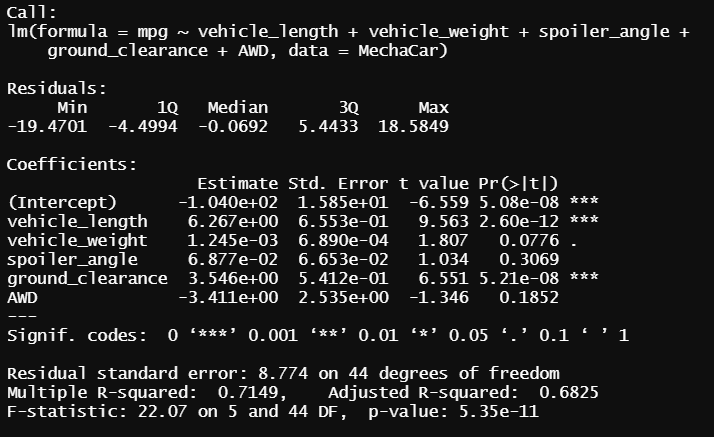

# MechaCar_Statistical_Analysis :red_car: :oncoming_automobile:	:blue_car:

## Linear Regression to predict MPG

* Vehicle length and ground clearance provide a non-random amount of variance to the MPG values in the MechaCar dataset
* The p-value(5.35e-11) for this regression is significantly lower than 0.05, and therefore we can reject the null hypothesis and state that the slope of the linear model is not considered to be zero
* For an inital multiple linear regression analysis without further intervention, this model predicts the MPG of MechaCar prototypes pretty effectively. We can say this because this model conveys that the ground clearance and vehicle length predict 71.5% of the variance in MPG. 

## Summary Statistics on Suspension Coils

* At an entire data level, the variance of the suspension coils is ~62 pounds per square inch and is well with the limit of 100 pounds per square inch :arrow_down:	
* But, when we look at the data from a lot level lens, we find that the variance of the suspension coils of **Lot3** is ~170 pounds per square inch and is well in excess of the limit of 100 pounds per square inch :arrow_up:
