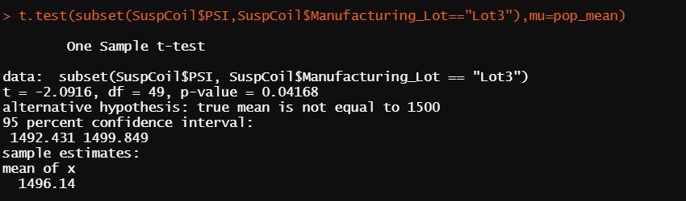

# MechaCar_Statistical_Analysis :red_car: :oncoming_automobile:	:blue_car:

## Linear Regression to predict MPG

* Vehicle length and ground clearance provide a non-random amount of variance to the MPG values in the MechaCar dataset
* The p-value(5.35e-11) for this regression is significantly lower than 0.05, and therefore we can reject the null hypothesis and state that the slope of the linear model is not considered to be zero
* For an inital multiple linear regression analysis without further intervention, this model predicts the MPG of MechaCar prototypes pretty effectively. We can say this because this model conveys that the ground clearance and vehicle length predict 71.5% of the variance in MPG. 

## Summary Statistics on Suspension Coils
 
* At an entire data level, the variance of the suspension coils is ~62 pounds per square inch and is well with the limit of 100 pounds per square inch :arrow_down:	

* At a lot level lens:
  * The variance of the suspension coils of **Lot1** is ~1 pounds per square inch and is well with the limit of 100 pounds per square inch :arrow_down:
  * The variance of the suspension coils of **Lot2** is ~7 pounds per square inch and is well with the limit of 100 pounds per square inch :arrow_down:
  * But, when we look at the data of **Lot3** we find that the variance of the suspension coils is ~170 pounds per square inch and is well in excess of the limit of 100 pounds per square inch :arrow_up:

## T-Tests on Suspension Coils

* For the t-test comparing the population mean(1500) against the PSI for entire sample, the p-value(0.06) is greater than 0.05, and therefore we fail to reject the null hypothesis. The mean of PSI for the entire sample is equal to the population mean. 

* For the t-test comparing the population mean(1500) against the PSI for Lot1 data in the sample, the p-value(1) is greater than 0.05, and therefore we fail to reject the null hypothesis. The mean of PSI for the Lot1 data in the sample is equal to the population mean.

* For the t-test comparing the population mean(1500) against the PSI for Lot2 data in the sample, the p-value(0.6) is greater than 0.05, and therefore we fail to reject the null hypothesis. The mean of PSI for the Lot2 data in the sample is equal to the population mean.

* For the t-test comparing the population mean(1500) against the PSI for Lot3 data in the sample, the p-value(0.04) is less than 0.05, and therefore we reject the null hypothesis. The mean of PSI for the Lot3 data in the sample is NOT equal to the population mean.

## Study Design: MechaCar vs Competition

The below is a short description of additional statistical studies that can quantify certain aspects of MechaCar's performance against the competition.

### Metrics to test
The study will test the following metrics comparing MechaCar v/s competition
* Maintenance cost
* Highway fuel efficiency

### Null hypotheses and alternative hypotheses
For Maintenance cost:
* Null Hypothesis - The mean cost of Maintenance of MechCar v/s competiton in the same segment are the same
* Alternate Hypothesis - The mean cost of Maintenance of MechCar v/s competiton in the same segment are not the same

For Highway fuel efficiency:
* Null Hypothesis - The mean Hwy fuel efficiency of MechCar v/s competiton in the same segment are the same
* Alternate Hypothesis - The mean Hwy fuel efficiency of MechCar v/s competiton in the same segment are not the same

### Statistical tests to use
For the purpose of this study, we will use multiple Two-sample t-tests. We will use one Two-sample t-test for MechaCar v/s each competitor.

We use the two-sample t-test because we will be comparing sample data of MechaCar v/s sample data of each competitor.
We cannot use ANOVA because maintenance cost and Highway fuel efficiency are both continuous values and not categorical values.

We can also convert the maintenance cost of MechaCar and all others into multiple buckets like >$30k,$20-$30k,$10-$20k,<$10k and use ANOVA

### Data needed
* Manufacturer
* Model name
* Year
* Maintenance costs per year
* Highway fuel efficiency
* Segment(sedan,SUV,Minivan etc.)

Optional
* Cylinders
* Transmission type
* City fuel efficiency
